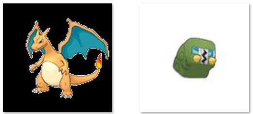
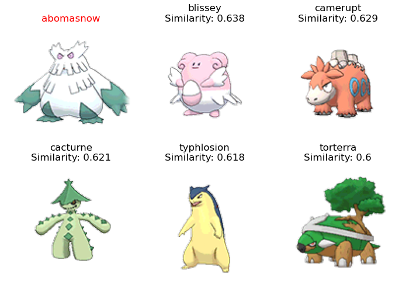
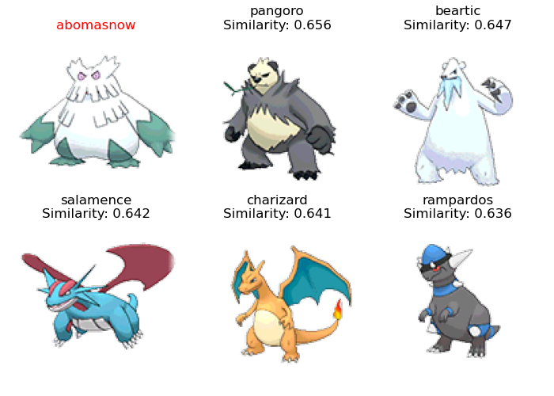

# image_similarity
## 이미지 유사도 구현 과제

- 주제 : 사전 학습된 keras 속의 CNN 모델을 이용하여 포켓몬의 유사도 구하기
- 데이터

  [Pokemon Image Dataset](https://www.kaggle.com/datasets/vishalsubbiah/pokemon-images-and-types)

- 실행 방법
  - 파일 경로에서 python main.py -p '포켓몬 이름' -m '모델 이름' 입력
  - 포켓몬 이름은 data 폴더의 csv파일 혹은 이미지 폴더 참조
  - 모델 이름은 vgg16 / resnet50 입력<p>
  
  예)
  ```powershell
  python main.py -p 'abomasnow' -m 'vgg16'
  ```

### 이미지 전처리 관련
- 포켓몬의 이미지 확장자가 png와 jpg가 섞여 있는 탓에 전처리가 필요하다
- png 파일은 색상 정보가 rgba의 4가지 정보로 저장되어 있는데 모델은 3가지 색상 정보만 입력받기 때문에 RGB로 바꿔주어야 한다.
- 그런데 변환해주는 과정에서 png는 배경이 검게 변한다.
  </img><br/>

- 이를 해결하기 위해 RGB값이 0인 경우 모두 255로 바꿔주었다.
  
  

  배경은 흰색이 되었으나 경계선이 생기고 튀는 픽셀이 조금 나타난다.

- 값을 바꾸기 전의 실행 결과
  
  </img><br/>
- 값을 바꾼 후 실행 결과
  
  </img><br/>
